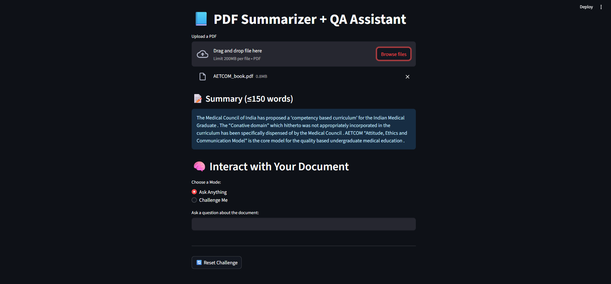
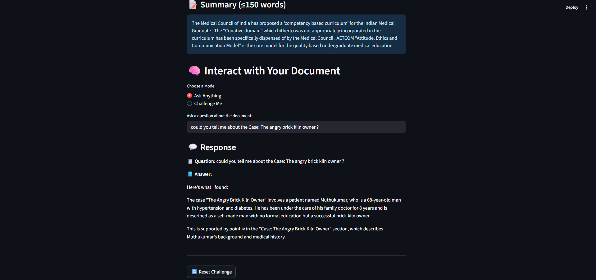
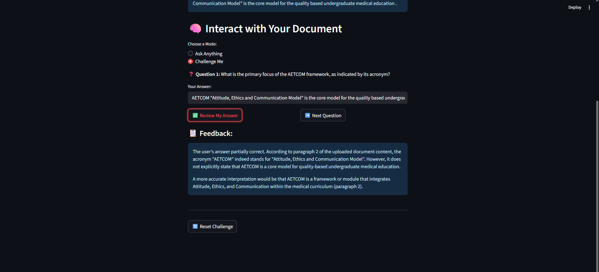
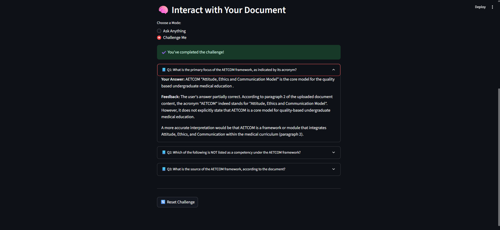

# 📘 Smart PDF Companion

An AI-powered assistant that reads, summarizes, and interacts with PDF documents. This tool is especially useful for researchers, students, and analysts to understand complex documents through summarization, intelligent Q&A, and logic-based reasoning — all grounded in the content of the uploaded file.

## 🚀 Features

- 📄 Upload any English PDF document  
- 📝 Auto-summary (≤150 words) after upload  
- 💬 Ask free-form questions and get contextual answers with citations  
- 🧠 "Challenge Me" mode generates 3 logical questions based on the PDF  
- ✅ Evaluates user responses with feedback and references to document sections  
- ⚙️ Runs completely offline using Ollama + open-source models  

## 📁 Project Structure
```
smart-pdf-companion/
├── app.py # Streamlit UI interface
├── summarizer.py # Summarization and PDF extraction logic
├── interactive_agent.py # Chunking, embeddings, QA & challenge logic
├── requirements.txt # List of dependencies
└── README.md # You're reading it!
```
## ⚙️ Setup Instructions

1. **Clone the Repository**
git clone https://github.com/AngelinaKB/PDF-Insight-Assistant.git

2. **Create and Activate a Virtual Environment**
python -m venv venv
source venv/bin/activate # On Windows: venv\Scripts\activate

3. **Install Dependencies**
pip install -r requirements.txt

4. **Start the Streamlit App**
streamlit run app.py


## 🧠 Architecture / Reasoning Flow

- **PDF Upload**: User uploads a structured PDF. Text is extracted using PyMuPDF.
- **Summarization**: First 2000 characters are summarized using `distilbart-cnn-12-6`.
- **Chunking & Embedding**: Text is split into chunks, embedded via `nomic-embed-text`, and stored in FAISS.
- **Ask Anything**: User question is matched with top chunks and sent to `llama3` via Ollama, returning an answer with justification.
- **Challenge Me**: The model generates 3 logic-based questions. User answers are evaluated with explanations and document references.


## 📦 Requirements

Install via `requirements.txt`:


## 🤖 Models Used

- Summarization: `sshleifer/distilbart-cnn-12-6`  
- Embeddings: `nomic-embed-text`  
- LLM: `llama3:latest` via Ollama  
## 🖼️ Demo

### 🔹 1. PDF Summarization
After uploading, a short summary is generated using a transformer model.


---

### 🔹 2. Ask Anything Mode
Ask any free-form question based on the document. The assistant finds the answer and provides a citation.


---

### 🔹 3. Challenge Me – Question Generation
The assistant generates 3 logic-based questions from the uploaded document.


---

### 🔹 4. Challenge Me – Answer Evaluation
Your answers are evaluated with feedback and document-grounded explanations.


---

## Credits

- Hugging Face  
- LangChain  
- Ollama  
- FAISS  
- Streamlit  


